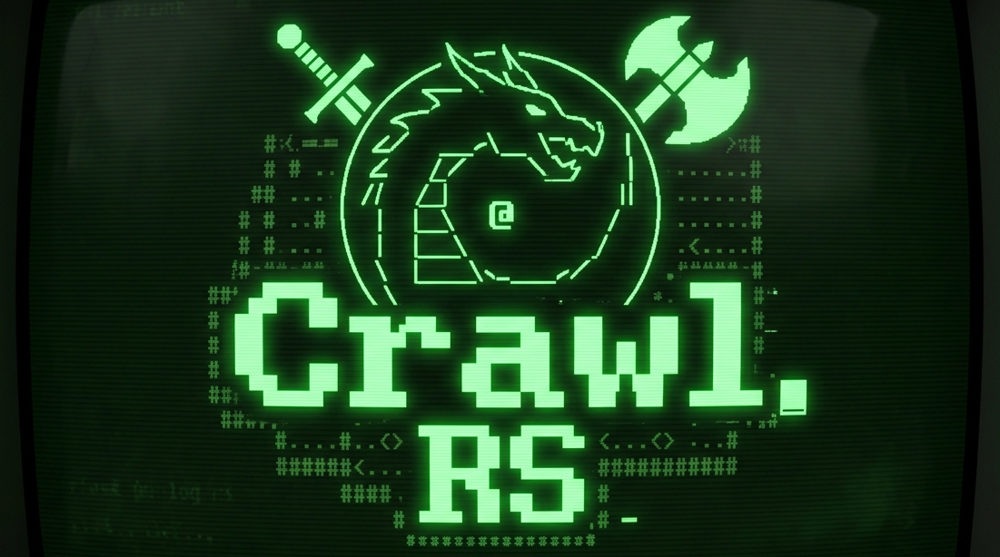
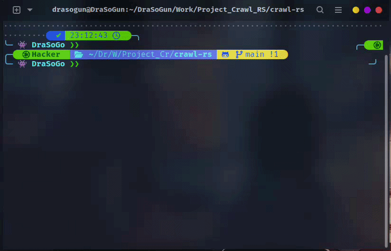

# ⚔️ Crawl RS: Roguelike game in terminal


<p align="center">
  
</p>

A classic ASCII roguelike in pure terminal Rust. Procedurally generated
dungeons, turn-based combat, permadeath. Runs over SSH; scales from a phone
shell to a 4K terminal.

---

<p align="center"></p>

## Install

Repository: <https://github.com/drasogun/crawl-rs>
Latest release: <https://github.com/drasogun/crawl-rs/releases/latest>

### Option A — pre-built binaries (no Rust required)

Each tagged release on GitHub attaches archives for the three supported
targets. Download the one that matches your platform from the
[releases page](https://github.com/drasogun/crawl-rs/releases/latest),
extract, and run the binary.

#### Linux (x86_64)

```sh
curl -L -o crawl-rs.tar.gz \
  https://github.com/drasogun/crawl-rs/releases/latest/download/crawl-rs-x86_64-unknown-linux-gnu.tar.gz
tar xzf crawl-rs.tar.gz
sudo mv crawl-rs-*/crawl-rs /usr/local/bin/
crawl-rs
```

#### macOS (Apple Silicon, arm64)

```sh
curl -L -o crawl-rs.tar.gz \
  https://github.com/drasogun/crawl-rs/releases/latest/download/crawl-rs-aarch64-apple-darwin.tar.gz
tar xzf crawl-rs.tar.gz
sudo mv crawl-rs-*/crawl-rs /usr/local/bin/
xattr -d com.apple.quarantine /usr/local/bin/crawl-rs   # only needed once
crawl-rs
```

#### Windows (x86_64)

PowerShell:

```powershell
Invoke-WebRequest `
  https://github.com/drasogun/crawl-rs/releases/latest/download/crawl-rs-x86_64-pc-windows-msvc.zip `
  -OutFile crawl-rs.zip
Expand-Archive crawl-rs.zip -DestinationPath .
.\crawl-rs-*\crawl-rs.exe
```

Move `crawl-rs.exe` somewhere on your `PATH` (e.g. `%USERPROFILE%\bin`) to
launch it from any directory.

### Option B — build from source

Requires Rust 1.75 or newer. Get it from <https://rustup.rs>.

```sh
git clone https://github.com/drasogun/crawl-rs.git
cd crawl-rs
cargo install --path crawl-rs
```

The binary lands in `~/.cargo/bin/crawl-rs` (Linux/macOS) or
`%USERPROFILE%\.cargo\bin\crawl-rs.exe` (Windows). Add that directory to
your `PATH` if it isn't already:

| Shell | One-liner |
|-------|-----------|
| bash  | `echo 'export PATH="$HOME/.cargo/bin:$PATH"' >> ~/.bashrc && exec bash` |
| zsh   | `echo 'export PATH="$HOME/.cargo/bin:$PATH"' >> ~/.zshrc && exec zsh` |
| fish  | `fish_add_path $HOME/.cargo/bin` |
| PowerShell | `[Environment]::SetEnvironmentVariable('Path', $env:Path + ';' + "$env:USERPROFILE\.cargo\bin", 'User')` |

### Option C — run without installing

```sh
git clone https://github.com/drasogun/crawl-rs.git
cd crawl-rs/crawl-rs
cargo run --release
```

## Run

```
crawl-rs                # title screen → new game / continue / quit
crawl-rs --seed 42      # skip menu, start a deterministic run
crawl-rs --dump --count 5 --seed 1
                        # print 5 BSP maps to stdout (no TUI)
~/.cargo/bin/crawl-rs
```

## Controls

| Key                        | Action                        |
|----------------------------|-------------------------------|
| `w a s d` / arrow keys     | move (4-way)                  |
| `q e z x`                  | move diagonally (NW NE SW SE) |
| `.`                        | wait one turn                 |
| `f` or `,`                 | pick up item                  |
| `i`                        | open inventory                |
| `>` (on `>` tile)          | descend stairs                |
| `esc` / `ctrl-c`           | save and quit                 |

`q` is the NW diagonal during play, so quitting is bound to `esc` (or
`ctrl-c`) to avoid clobbering a movement key. On the title screen and the
death/victory screens, `q` still works as quit.

In the inventory screen, the up/down arrows (or `w` / `x`) move the cursor,
`f` (or `enter`) uses or equips the highlighted slot, and `s` sells the
slot for XP (equipped items auto-unequip on sale). Use a potion of healing
for HP, a scroll of mapping to reveal the level, a scroll of teleport to
fling yourself, or wear armor / wield weapons for permanent stat bonuses.
`esc` or `i` closes the screen without spending a turn.

## Levelling

Killing mobs and selling items both award XP. Each level requires
`50 × current_level` XP. On level-up the player gains **+5 max HP, +5 HP,
+1 attack, +1 defense**. The HUD shows current level + progress as
`lv N (xp/needed)`.

## How it works

- ECS via [`hecs`](https://crates.io/crates/hecs)
- BSP dungeon generation per level (10 levels, increasing density)
- Recursive shadowcasting FOV (8 octants, radius 8) with memory tiles
- Energy-based scheduler (`speed` per tick, act at 100)
- Bump-to-attack combat: `max(1, atk + 1d4 - def)`
- Bincode save (single slot, deleted on death)
- Deterministic given `--seed N` — record this in any bug report

## Win condition

Reach depth 10 and pick up the Amulet of Yendor. Permadeath: you die, the
save file is gone, and your score is recorded in the high-score table.

## Notable seeds

See [`examples/seeds.txt`](examples/seeds.txt).

## Demo

Recording a play session: `asciinema rec demo.cast` then play with
`asciinema play demo.cast`. Drop the recording into the README of any fork
you make.

## License

MIT — see [LICENSE](LICENSE).
